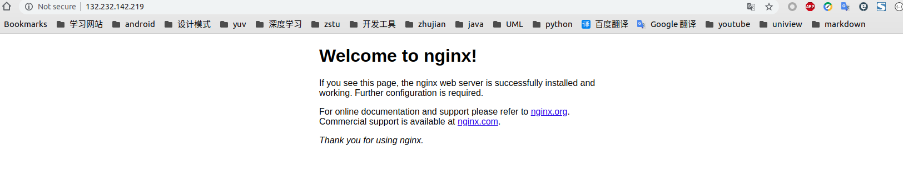

# [Ubuntu 16.04]nginx测试

参考：

[linux下解决80端口被占用](https://blog.csdn.net/w592376568/article/details/82862249)

[Nginx安装](http://www.nginx.cn/install)

`nginx`占用`80`端口，确保未被使用

    $ sudo netstat -lnp | grep 80
    tcp        0      0 0.0.0.0:80              0.0.0.0:*               LISTEN      22308/nginx: master

启动`nginx`

    sudo nginx

打开浏览器，访问该机器的`ip`，即会出现`nginx`欢迎页面

